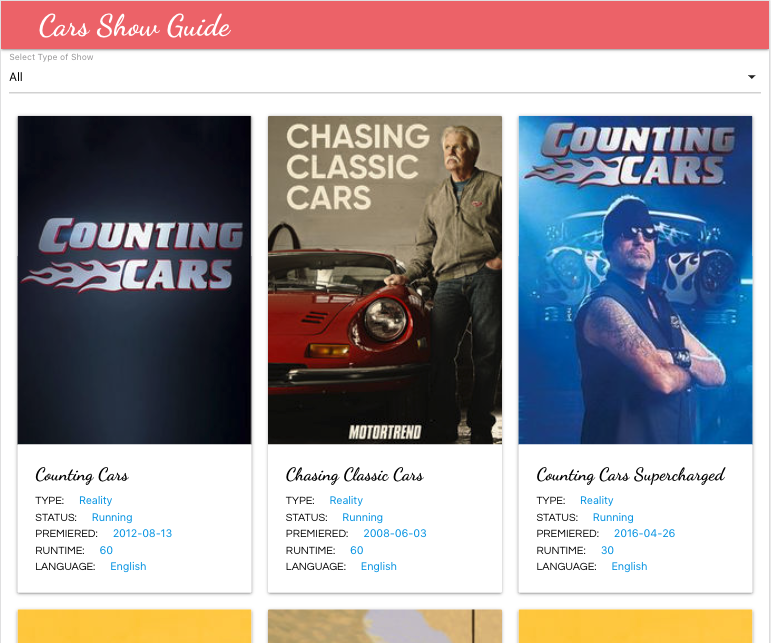

 # Car Show Guide
A front-end React application for viewing car tv shows and their details. The data for the shows were obtained from [TV Maze API](https://www.tvmaze.com/api) using the fetch API and stored in the Redux store to be accessed by multiple components. There is also a filter feature for filtering car shows.
This project was set up with [Create React App](https://github.com/facebook/create-react-app).

# Screenshot

## Built With
- React.
- create-react-app tool.
- Redux.
- Materialize.
- [TV Maze API](https://www.tvmaze.com/api).

## Live Video Presentation.

Click [here]() to watch a video presentation of the web app.

## Live Demo

Click [here](https://car-show-guide.netlify.app/) to visit a live version of the web app which has been deployed to Netlify.

## Getting Started

To get a local copy up and running follow these simple example steps.

### Prerequisites

- NPM.
- Javascript.
- React.

### Setup
- Clone the repository by running in your `git clone https://github.com/krys2fa/tv-show-guide.git ` terminal/command line.
- Run `npm install` to install dependencies.
- Run `npm start` to start the development server.

## Author

👤 **Christopher Amanor**

- Github: [@krys2fa](https://github.com/krys2fa)
- Twitter: [@krys2fa](https://twitter.com/krys2fa)
- Linkedin: [Christopher Amanor](https://www.linkedin.com/in/christopher-amanor/)

## 🤝 Contributing

Contributions, issues and feature requests are welcome!

Feel free to check the [issues page](https://github.com/krys2fa/tv-show-guide/issues).

## Show your support

Kindly give this repository a ⭐️ if you like this project!

## Acknowledgments

- Project specifications by [Microverse](https://www.microverse.org).

## 📝 License

This project is licensed under the MIT License.

